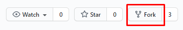
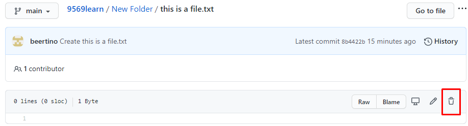

# 9569learn
9569 Learning Group

- [Version Control](#version-control)
- [So, what is Version Control?](#so--what-is-version-control-)
- [Git and GitHub](#git-and-github)
  * [Forking a Repository on GitHub](#forking-a-repository-on-github)
    + [Task 1](#task-1)
  * [Creating a Folder On GitHub](#creating-a-folder-on-github)
    + [Task 2](#task-2)
  * [Deleting a File On GitHub](#deleting-a-file-on-github)
    + [Task 3](#task-3)
  * [Pull Request](#pull-request)
  * [Markdown Language](#markdown-language)

<small><i><a href='http://ecotrust-canada.github.io/markdown-toc/'>Table of contents generated with markdown-toc</a></i></small>

# Version Control

> Save Early, Save Often — *Every programmer who lost their code*

Imagine you are taking short notes down in `Word`. You made some more changes to the notes, delete some sections. Before you close the file, it prompted you to save and you clicked `Yes` . Right after you click, you realized you deleted the wrong sections! *Sianz. Now I gotta find those parts of the notes and reinsert.* Well, you wouldn't need to go through all this experience if you would have used version control.

# So, what is Version Control?

Version control is a system that records changes to a file or set of files over time so that you can recall specific versions later. ʳᵉᶠ 

Fortunately, this system is so ubiquitous right now and you might even have used them in Google Docs under `File>Version History>See Version History` to restore that important paragraph that your project mate deleted for your group project 🤣.

Example of version control in Google Docs. 

There are multiple version control systems out there like Apache's `Subversion`, Concurrent Versions System ( `CVS`), but we will be using Git (which why this file is hosted on github) 

# Git and GitHub

> Git is NOT the same  GitHub

Git is a distributed version-control system for tracking changes in source code during software development. It is designed for coordinating work among programmers, but it can be used to track changes in any set of files. ʳᵉᶠ TLDR: Git is a program that tracks changes made to files. To use Git on your local machine, you need to install it from [git-scm.com](http://git-scm.com).

On the other hand, GitHub is a cloud-based **hosting service** that lets you manage Git *repositories*, which is roughly a folder that contains various different versions of the files.

## Forking a Repository on GitHub

*Forking a repository* means that you're making a copy of someone's project. To do this on GitHub, on the top-right corner of the page, click `Fork`. 

### Task 1

Fork this repository to add to your own GitHub account. 

After forking, your will arrive at `github.com/YOUR_ACCOUNT/9569learn` , your own copy of the repository.

## Creating a Folder On GitHub

To create a new folder in a repository click `Add file>create a new file`. Type your new folder’s name in the area where you would write the file name, and at the end of the file name type a `/` to initialize it as a folder. After this you can create a new file in the folder. ʳᵉᶠ After you're done, scroll down and click on `Commit new file`.

Or, you can just drag and drop. 😂. 

### Task 2

In your forked repository, create 2 folders, one called `Databases` and `DeleteMe` that each contains a file called `mysql.py` inside the folders. 

## Deleting a File On GitHub

Browse to the file in your repository that you want to delete. Locate the dustbin icon on the top right hand corner of the editor (next to the pencil icon) and click on it. Click `Commit changes` afterwards.

### Task 3

Delete the file `mysql.py` in the folder `DeleteMe`. What happens to the folder `DeleteMe` in your repository?

You would have noticed the word `commit` being used repeatedly. This is actually the mechanism behind how `git` work. Roughly speaking, `commit`  saves the changes you made in your local repository without affecting the original repository.

## Pull Request in GitHub

When you open a `pull request`, you're proposing your changes and requesting that someone review and pull in your contribution and merge them into their branch. This feature is a very useful feature when you're trying to improve someone's code and collaborate with them. 

To do this, click on `Pull request` on top of your repository. 

In the next page, click on `Create pull request` .

Afterwards, you will be brought to a page where you can detail the changes you made to the repo and your rationale for doing so. The owner of the repo that you fork from will have the ability to authorize your requests and merge your repo with their existing one.  

### Task 4

Create a file named `YOUR_NAME.txt` in your repo, inside the file, type what cool thing thing you would like to do whilst learning computing and do a `pull request`.
